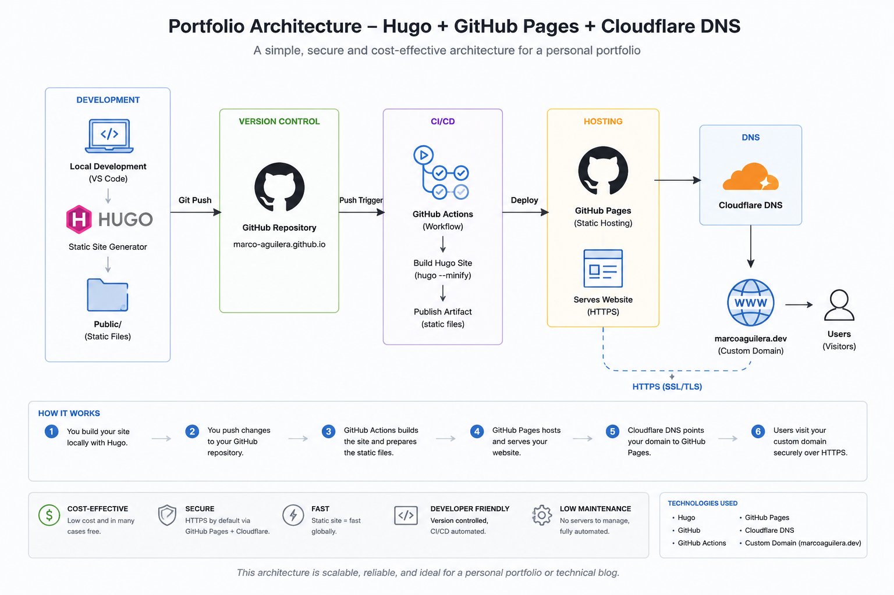

I wanted to have a space that I could use to write about my experiences in technology. I contemplated many ideas, but ultimately I gathered the courage to begin writing about the areas and topics that I cover in engineering. Another reason for this is to help me improve my understanding of what I am learning so I can get more comfortable talking about these topics. Lastly, I hope that this space helps me showcase my experience and serve as proof for anyone who may have my resume in front of them.

I wanted my focus to be on sharing my experiences, so I chose a simple setup using Hugo, GitHub, and Cloudflare. I could have used other blog/article sites like WordPress, Medium, and Substack, but I wanted to have my own space that I could maintain and have as a small project.

The core issue was finding a space where I could share my experiences and projects as a way to showcase them and also as a way for me to learn. Ultimately, I decided to proceed with having a low-cost, version-controlled, and easy-to-maintain portfolio that came with a template that I could make some modifications to.

The technologies I used were VS Code to implement the Hugo server that contained the template I wanted to pull from. I decided to use Git version control to track changes locally and treated my local build as a development space before pushing it to the GitHub repository, following CI/CD practices to have it live in the main branch. Finally, I had the static site available using GitHub Pages, where I could have finished the project, but I chose to go a step further and decided to purchase my custom domain because I did not want to have {pages} within the URL. That was more of a visual/cosmetic decision that I could have lived with, but I knew I could leverage the speed, security, and reliability that comes with paying a little bit for DNS resolution.

Below, I included the architecture overview of the different tools I used to create this site.

There were a few challenges that I encountered in this engineering portfolio project.

**The 1st Challenge:**

Deciding between a GitHub Pages user site vs. a project site.
This challenge is not a technical one but more of a psychological challenge because I could have proceeded with GitHub Pages at no cost and still would have had a static website that contained my writing entries and projects. This approach would still utilize version control, and at the time of writing this, a part of me believes this was sufficient. However, I decided to go for the project site because something convinced me that having my own name on the URL without the GitHub Pages portion of it would make the whole thing look more professional. On top of that, paying for the custom domain came with a few security perks.

**The 2nd Challenge:**

Custom Layout vs. Hugo Layout
I knew that I wanted to be able to focus on my writing and sharing my experiences more than parts of the infrastructure, such as markup files that set up the design. My vision was to have a minimalistic portfolio that aligned with Hugo's default layout, but I had a couple of sections I envisioned for the portfolio's design that would require some editing and maintenance. I wanted the main page to have a small bio and include two sections that contain the latest projects and blogs, and I decided to override the hugo.toml and add an index.html by dividing those three sections. The rest of the portfolio follows Hugo's layout with the top navigation buttons and cells it creates for the blogs and projects. This also allows me to change the design or add other functionalities over time and improve the UX.

**The 3rd Challenge:**

GitHub Pages vs. Cloudflare Pages
I initially tried using Cloudflare Pages, but it kept directing me to the worker section and would take my GitHub repository as a static site and try to use the npx wrangler deployment, which would not work because mine was a Hugo deployment. I also noticed that the navigation was something I was not very accustomed to, so I turned to GitHub Pages because it could have my static site live in its Pages feature. Afterward, I used Cloudflare to pull that GitHub Pages URL to set up the custom domain on Cloudflare. The decision to use GitHub Pages was purely due to ease of use, and setting up the pages was friendlier. Since I already had my repository in GitHub, it only made sense to have it integrate with GitHub Pages.

**Lessons Learned:**

Leverage the tools accessible to you to get the answers to your issues fast. I was able to find what the next steps were rather quickly. If you're stuck on something or don't know the answer, use your favorite flavor of AI chat to help you out. This will also help you fill in the gaps on certain technical topics. Always double-check the information you are getting because it's not always correct.

Don't reinvent the wheel. If you have layouts that can help you put out some of your content and experience, then take advantage of that. I remember a few years ago I built my webpage portfolio using HTML, CSS, and JavaScript, and it was a lot of fun; however, I spent too much time on the design and functionality portions that I forgot to invest the time in the content of the portfolio. That is why this portfolio will be minimalistic to share my experiences and projects.

**Key Takeaways:**

- Hugo has an excellent foundation for minimalistic engineering portfolios.
- GitHub Pages gives users the ability to have a space without hosting complexity.
- Cloudflare gives users professional branding via a custom domain.

**What's Next:**

The next entries will be about some observability projects and practices and will continue with different topics that I wish to explore and learn from by documenting my challenges throughout the builds.
If you have reached this far into the first post, I want to thank you and invite you to keep an eye out for the next one
